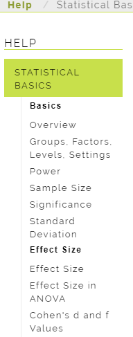
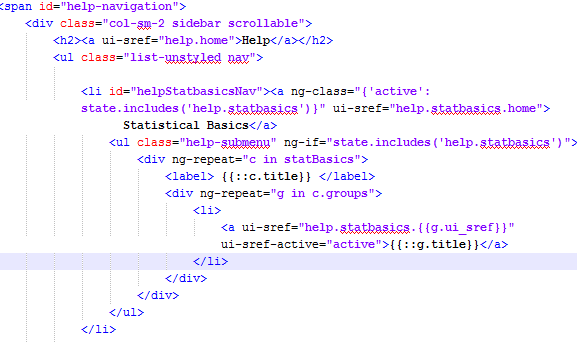
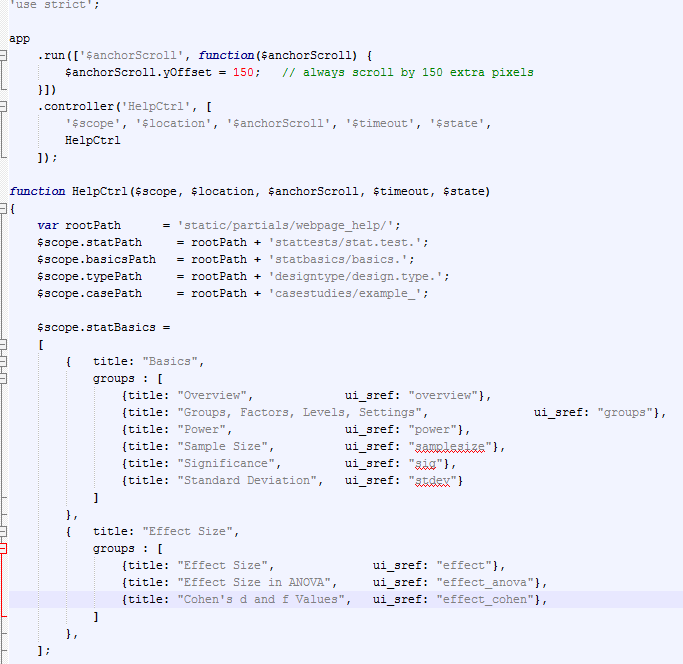

# Help Pages

In addition to adding routes with the [Python file](routes.js#approutespy), we have a little something extra to deal with thanks to the sidebar and sub-menus in the Help pages. 

## Sidebar UI
What the sidebar is actually rendered as to the end user looks like the image below.




## Sidebar HTML
However, instead of creating a long HTML file, I set some variables so that the HTML file looks like. Notice the `ng-repeat` whicih loops over some variables. See the [section below](#sidebar-js).




## Sidebar JS
In Javascript, this means we have to declare some variables in order to generate the proper sidebar. Again, instead of editing the HTML file we can just edit it once here, and the changes will propagate. The main reason I did this is because we loop over the titles and links more than one time. Without this, we would have to change titles and links in more than one HTML file, possibly leading to broken links due to user error. 



## Adding a sublink

To add a link to a current page, follow the instructions for creating a new route. For whichever page you want it on (statbasics, stattests, casestudies, tutorial, designtypes), append it to the relevant variable in the JS file. For example, to add to the "Basics", we would edit the help controller to write

```javascript
$scope.statBasics = 
[
    {   title: "Basics",
        groups : [
            // Add this next line to include it in the statbasics page
            {title: "MY NEW PAGE", ui_sref: "A_NEW_LINK_I_CREATED"},   
            
            // previous code goes below, or whichever order you want it in
            {title: "Overview",    ui_sref: "overview"},
            /*
                ... etc.
            */
    },
];
```

## Adding an entirely new page

In order to add a new page (assuming you've already added a link through [Python](routes.js#approutespy)), you will need to edit `static/partials/home.html` which includes the sidebar links. If you don't need a submenu (e.g. FAQ, glossary, contact us pages), you won't need to do anything particularly complicated. 

If you do want a submenu in the sidebar, follow the template for statbasics or stattests, for example. 
