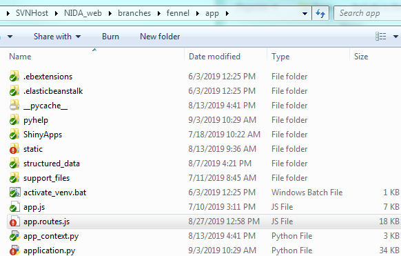
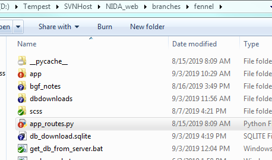
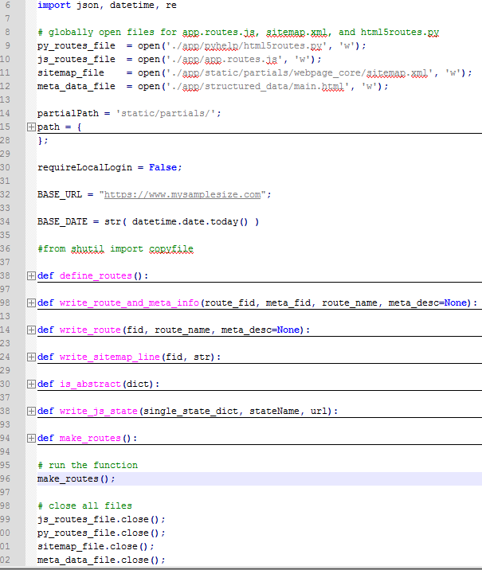
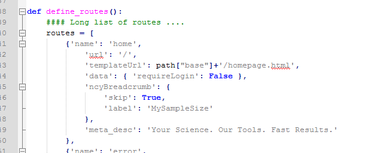
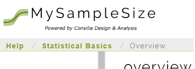
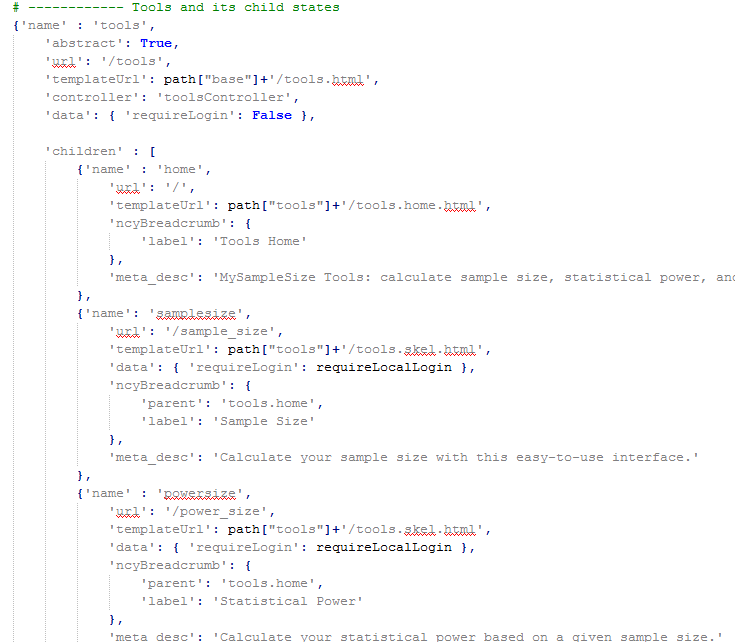

# AngularJS Routes
In AngularJS, routing is what allows you to create Single Page Applications. AngularJS routes enable you to create different URLs for different content in your application. AngularJS routes allow one to show multiple contents depending on which route is chosen. A route is specified in the URL after the # sign.

# Routing file - app.routes.js

The AngularJS routes are all defined in the main folder, under app.routes.js. However, **these routes are generated through a Python file, and should not be edited directly**. 

Instead, let's look at the file `app_routes.py` in the parent folder.

# Generating routes - app.routes.py

This Python file does more than just generate the AngularJS routes, app.routes.js. It also
- writes `pyhelp/html5routes.py`
- generates `sitemap.xml` for SEO
- generates HTML metadata for SEO

The first item, **`pyhelp/html5routes.py`**  is very important as it defines every single possible AngularJS route when running through Flask. This is a little complicated, but essentially when you first load the page -- since we are using a Flask server -- the page must load through Flask. After that load, it internally uses AngularJS. 

> Run this file at the command line by typing `python -m app_routes` to generate the files

To add a new route, simply go to the function `define_routes()` in `app_routes.py`, and add data. See the documentation [below](#routes-overview) for some details. What I usually do is copy-and-paste an existing route, then modify that to what I need. 

_______________________
# File app.routes.py Overview :id=routes-overview

This describes *very briefly* how the file works. 

Below, we have the overview of the file, collapsed by function. The `make_routes()` function is the main entry point. The function `define_routes()` is where you want to go to add files and ui-routes. 

## Defining Routes

In the `define_routes()` function, we make a variable containing a series of `dict()` objects. The first image below shows the start of it. We will define a route with the `ui-sref` name of `home`. Its url template comes from `static/partials/homepage.html`. The `meta_desc` field is for SEO metadata that goes in `html5routes.py` (and eventually, written in the HTML header).

The `data` field is a field I added to identify whether or not a page needs logged-in access. In this case, for the homepage, it does not. The `ncy_breadcrumb` field is for navigation. It appears on 

### define_routes() start:

### Breadcrumb example: 
You can see the implementation of `ncy-breadcrumb` in the Help pages. 

## Child Routes

Here, we see other examples for how the tools pages are made. We define the main page, and set the key `children` to be a vector of `dict()` objects. The way I've coded it works so that these become AngularJS child routes. 

