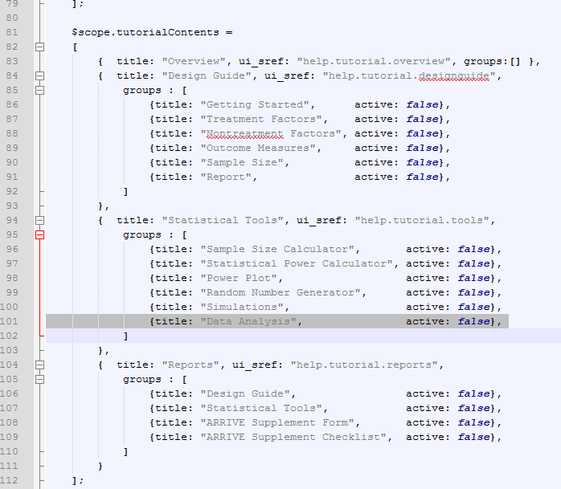
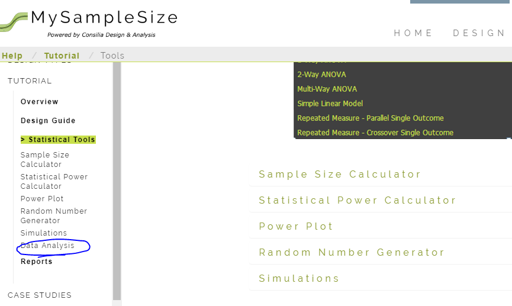
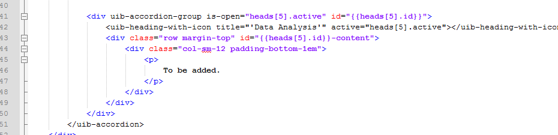
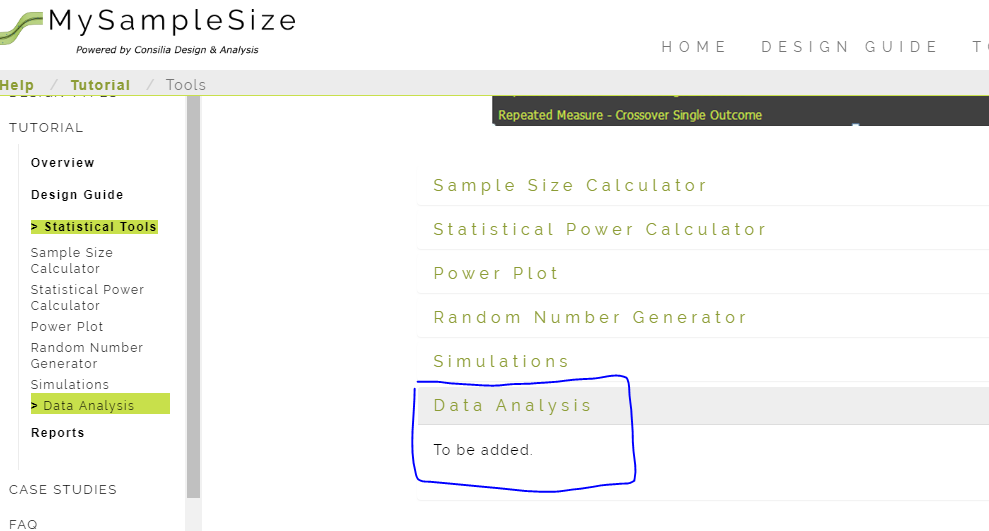

# Help > Tutorial Pages

I will be adding a *Data Analysis* section to the Tutorial, and will show how I specifically go about that here.

## Modify helpController.js

Because the contents are only needed to be specified here, we start here. Add a line to the `tutorialContents` variable under the "tools" key. 

## Sidebar is updated
After a page refresh, we will see that in the sidebar. However, we do not see the item in the content of the page.

## Edit the HTML

In order to add content, we will add lines to `tutorial.tools.html`. In the file below, I have added data and also incremented the index in the `heads` variable (initialized at the top of the file). This variable controls the open-and-close function of the uib-accordion.  

## Done

Upon expansion, we will see the content we created.

