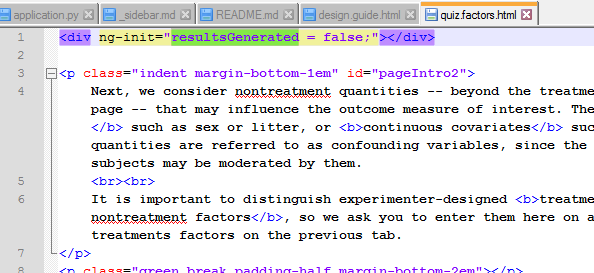
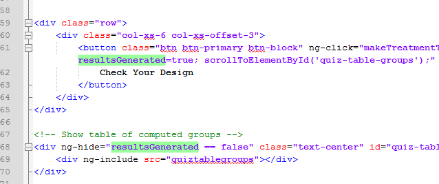
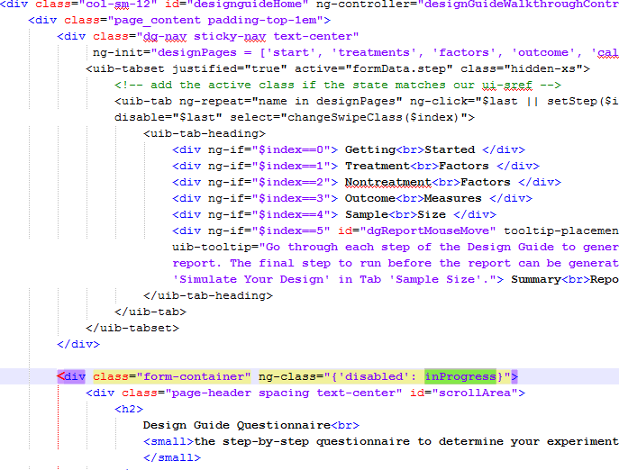
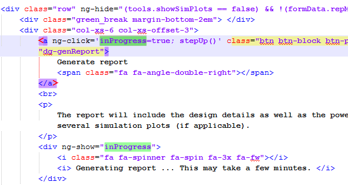
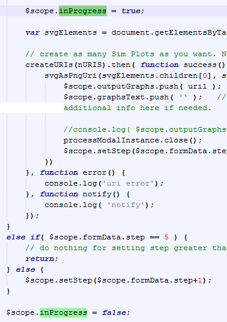

Variables can be initialized in two methods, using `$scope` in a controller so that they can be used in several HTML files or used for important calculations, or using `ng-init` in a HTML file for local use. 

## ng-init Example
An example of using `ng-init` is shown below for the "Non-treatment Factors" tab of the Design Guide.

Here, I create and initialize a variable called `resultsGenerated` to use for displaying and hiding some elements. In this particular case, if the value is false, do not show the table which displays all possible groups.

My reasoning for doing this is that I don't need this variable in the controller. Since it just controls one small aspect of visibility, I don't want it cluttering the controller -- which, in my mind, should function as more "important", top-level code.

## Display control

The previous example dealt with displaying elements using `ng-init`. I will provide here another example of displaying and hiding elements but using a variable initialized in the controller scope. 

In the Design Guide, I have the `inProgress` variable used to indicate when the report is being generated at the end. In doing so, I "disable" the Design Guide, making it so that no clicks can happen while the report is being generated (see below).

Because this variable is changed on the last tab (see below), but has some control over the overall display, and depends on the status of the png graph images being generated, I initialize it in the controller.

As the graphs are being generated, `inProgress` is true. When the graphs are done, we set `inProgress` to false so that tab navigation can resume for the user. This is shown in the code below from the Design Guide controller (JS file).

