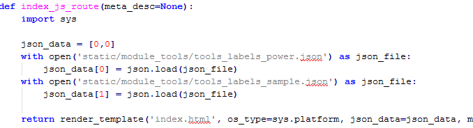
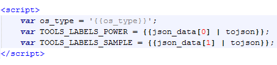
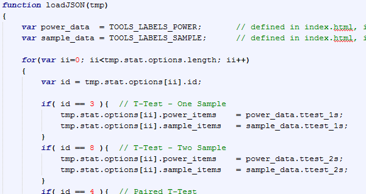

# Power and Sample Size Variables

In the power and sample size calculation pages, the HTML looks clean but is a little obfuscated ([see code here](#html-code)). I will explain how it works and why I implemented it this way.

______________________________
# Reasoning

The main reasoning behind this implementation was to get rid of the `<ng-if>` statements. That is, if one-way ANOVA, then display \< something \>, if two-way ANOVA, display something else, etc. I wanted to clean up the code and make a central place to change variables, limit the range on inputs, and change the label of the inputs. For this reason, I created two JSON files (one for power, one for sample size) that define the necessary input data. In essence, the HTML should not change but the JSON data might. 

## Why JSON? 
The other reasoning for initializing in JSON instead of in the controller (JS) is that JSON is relatively human-readable. I figured it might be easier to go to a text file instead of searching `toolsController.js` to determine where to change the values, and putting in JS would also clutter the code. 

______________________________
# Variable Initialization in JSON

We begin by starting with the JSON files. Below is an excerpt from `tools_labels_power.json` in `app/static/module_tools/`.


Each statistical test has a variable number of elements. For the image shown above -- 1-Sample T-Test -- we have four elements which will correspond to user input. The fields that are a part of each input are outlined in the table below.


| Name | Description |
|-----------|---------|
| `label` | What is displayed to the left of the input box
| `min` | The minimum acceptable numerical value
| `max` | The maximam acceptable numerical value
| `step` | The numerical step size if using arrows to increment the value
| `flag` | Used to determine if additional inputs needs (e.g. treatments for ANOVAs)
| `disabled` | Used to determine is the input is disabled when embedded in the Design Guide
| `tooltip` | Variable for the tooltip content. See [tooltips](#tooltips) below
| `tooltip_link` | `ui-sref` link for standalone Help information
| `model` | The binding for a variable in `calculatorService` data

# Numerical Limits
As you can see in the [HTML code](#html-code), the `min`, `max`, and `step` information is also used to display the warning tooltip and specify what the numerical limits are. This creates a more programmatic code instead of having to check in multiple to verify whether or not our information is correct. 


# Tooltips

The `<tooltip-link>` (and `<tooltip-warn>`) directive is a [directive](https://docs.angularjs.org/guide/directive#template-expanding-directive ':target=_blank') that I created to enable easy usage of uib-tooltips. They are defined in `app/static/module_modals/custom_directives.js` under *tooltipLink* and *tooltipWarn*. The practice of naming directive and usage of it is
 
- When defining a new directive, the directive name should be in camelCase.
- When using it in HTML, use it in dash-delimited style.

For whatever reason, camel-case directives translate to hyphens in HTML practice. Since HTML is case insensitive, Angular translate camelCase directive to camel-case attributes on DOM elemens. 

# Model (ngModel)

This is demonstrated with an example, "Measurement SD". The model is *esSD*, which means that the binding for that input is `calculator['data'][item.model]` where `item.model` is the string "esSD" -- i.e. `calculator.data.esSD`. `calculator` comes from setting 

```javascript
$scope.calculator = calculatorService
```

in `toolsController.js`.

______________________________
# HTML Code
```html
<div ng-repeat="item in design.stat.selectedOption.power_items track by $index" ng-form="nestedForm">

    <!-- "NORMAL" INPUTS -->
    <div class="col-xs-8" ng-class="{'col-md-5': design.notEmbedded}" ng-if="item.flag == 0 || item.flag === undefined">
        <label>{{::item.label}}</label>
        
        <input type="number" name="inp{{$index}}" min="{{item.min}}" max="{{item.max}}" step="{{item.step}}" 
            ng-model="calculator['data'][item.model]" ng-change="calculate();" ng-disabled="item.disabled && !design.notEmbedded" 
            uib-tooltip-html="esTooltip.content" tooltip-trigger="'focus'" tooltip-enable="esTooltip.enabled(item.label)" tooltip-popup-delay="1000" 
            required>
    
        <tooltip-link content="item.tooltip" url="{{item.tooltip_link}}" ng-show="nestedForm.inp{{$index}}.$valid"></tooltip-link>
        
        <tooltip-warn content="'Please fill out this field'" ng-show="nestedForm.inp{{$index}}.$error.required"></tooltip-warn>
        
        <tooltip-warn content="'Please select a value between '+item.min+' and '+item.max+'.'"
            ng-show="(nestedForm.inp{{$index}}.$error.min || nestedForm.inp{{$index}}.$error.max) && !nestedForm.inp{{$index}}.$error.required">
        </tooltip-warn>
    </div>
    
    <!-- TREATMENTS -->
    <div ng-if="item.flag" class="col-xs-8" ng-class="{'col-md-5': design.notEmbedded}">
        <div ng-repeat="treat in item.treatments track by $index">
            <label>{{::treat.label}}</label>
            
            <input type="number" name="treat{{$index}}" min="{{treat.min}}" max="{{treat.max}}" step="{{treat.step}}" 
                ng-model="calculator['treatments'][$index].levels" ng-change="calculate();"
                ng-disabled="treat.disabled && !design.notEmbedded" required>
            
            <tooltip-link content="treat.tooltip" url="{{treat.tooltip_link}}" ng-show="nestedForm.treat{{$index}}.$valid"></tooltip-link>
            
            <tooltip-warn content="'Please fill out this field'" ng-show="nestedForm.treat{{$index}}.$error.required"></tooltip-warn>
            
            <tooltip-warn content="'Please select a value between '+treat.min+' and '+treat.max+'.'"
                ng-show="(nestedForm.treat{{$index}}.$error.min || nestedForm.treat{{$index}}.$error.max) && 
                        !nestedForm.treat{{$index}}.$error.required">
            </tooltip-warn>
        </div>
    </div>

    <!-- Repeated Measures effect size -->
    <div ng-if="item.flag == 2" class="text-left padding-top-2em col-xs-8 col-xs-offset-2">
        <div ng-include="'static/partials/webpage_tools/repMeasuresES.html'"></div>
    </div>
    
</div>
```
______________________________
# JSON to JS

Now, how is the actual JSON data imported to JS? 

## Python Routes
Everytime you load a page for the first time, it goes through `html5routes.py`, which is in `app/pyhelp/`. (After the first load, all the routing is done in AngularJS).



Before the template is rendered, we read the data in Python and pass it as a variable to the template, index.html. 

## index.html

This data is then brought in and made a global JS variable in `index/html`, and the string input is converted to a JS object (what `tojson` is doing).



## Save in DG service

Next, these variables are loaded and saved permanently in the Design Guide service. They are assigned to their respective statistical test in the for loop. 



## Use as needed
Every time the statistical test changes, `designService.stat.selectedOption` changes. This contains several keys, including `power_items` and `sample_items` from the JSON files. When it's called in `tools.power.html` for example, we loop (ng-repeat, see the [HTML code](#html-code)) over the `power_items` to generate the end user look. 
