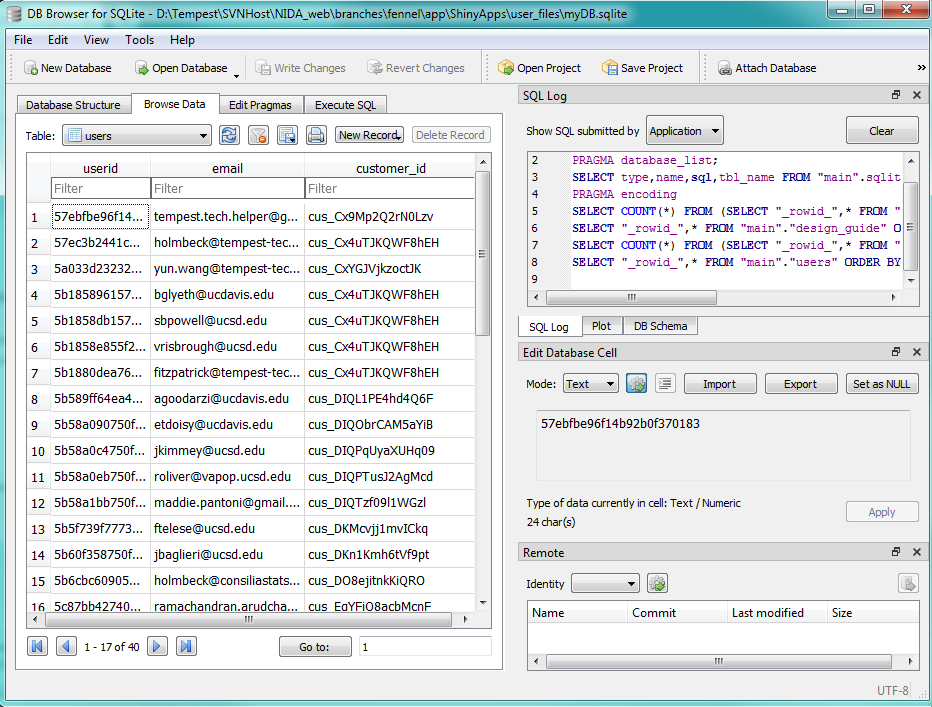
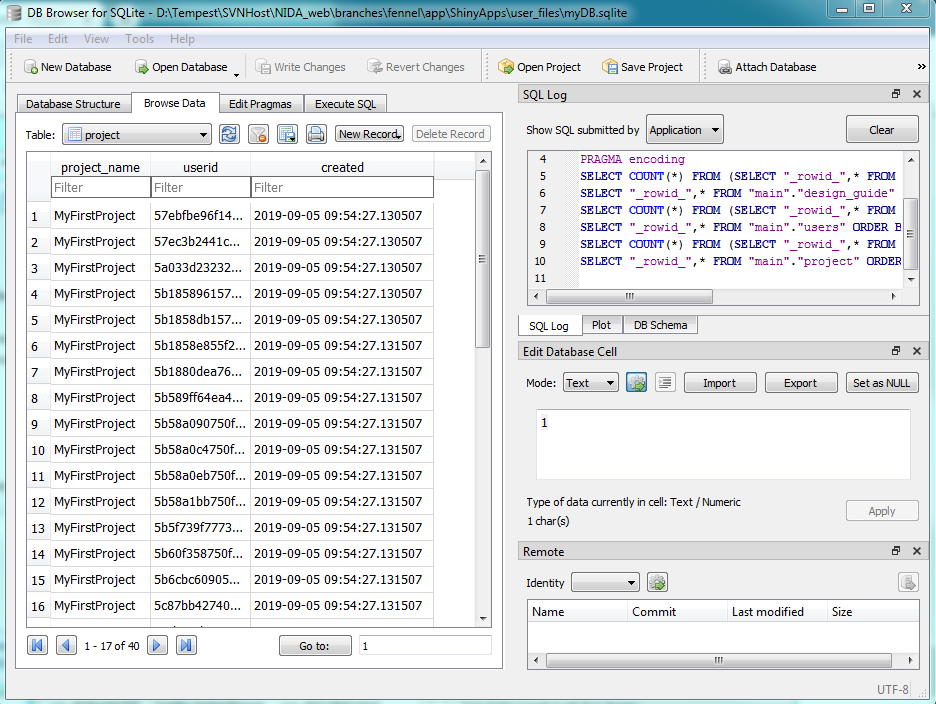

# Creating the Database

The database is ideally created only once, then maintained for the span of its life. However, it may be the case that the database needs to be rebuilt for one reason or another. Because of this, there is a file in `ShinyApps/user_files/makeDB.py` that will generate a database from a clean slate. For safety, the existing working copy database is **not** overwritten. 

# Why?

In the early stages of development, I often reconstructed the database using existing Auth0 users in order to wipe their information and start from a clean slate. Since we were in testing, this did not have any significant effect on users.

Now, a reason to rebuild the database might be, for example:

> You are changing the format of a table. Make a new database from the Auth0 data, and individually export data. Test on this new database to make sure everything is "ok". 

In general, you could probably get away with just making a database copy and then modifying data from there. To reiterate, when we were in bulk adding and deleting users, it was easiest to use the methods described below. 

____________________________

# makeDB.py

[makedb](makeDB.md ':include')

____________________________

# Initializing from Auth0 JSON data

# Exporting users from Auth0 {docsify-ignore}

[exporting](exporting_users_from_auth0.md ':include')


## makeDB, revisited :id=json-init

The part of `makeDB.py` below has functions that actually add Auth0 exported JSON data to the database. To make a new database from a JSON file, for example webmaster.json, do the following in Python:

```python
import makeDB
makeDB.create_DB_from_auth0_file("webmaster.json")
```

The database is then created using the Auth0 data, with a blank "MyFirstProject" initialized for each user.

### Users table


### Projects table

All projects created around the same time.



### Relevant code for reference
In cluded in `makeDB.py`:

```python
def create_DB_from_auth0_file(fname):
    makeDB()
    json_list = load_auth0_json( fname )
    create_auth0_users( json_list )
    
# load the JSON file provided from Auth0
def load_auth0_json( fname ):
    
    with open(fname) as f:
        lines = f.readlines()
    
    for ii in range( len(lines) ):
        lines[ii] = json.loads( lines[ii] )
    
    return lines
    
# From a list of dict objects, insert users into the database
def create_auth0_users( json_list ):
    global DBNAME
    conn = sql.connect(DBNAME)
    c = conn.cursor()

    # create a user and empty project associated with that user
    for tmp in json_list:
        user_id = tmp["Id"]
        user_id = re.sub("auth0\|", "", user_id)    # parse out the "auth0|" in front of the id
        metadata = tmp["user_metadata"]
        c.execute("INSERT INTO users(userid,email,customer_id) VALUES(?,?,?)", (user_id, tmp["Email"],metadata["customer_id"]))
        c.execute("INSERT INTO project(project_name,userid,created) VALUES(?,?,?)", ("MyFirstProject", user_id, str(datetime.datetime.now())) )
    
    conn.commit()
    conn.close()
```