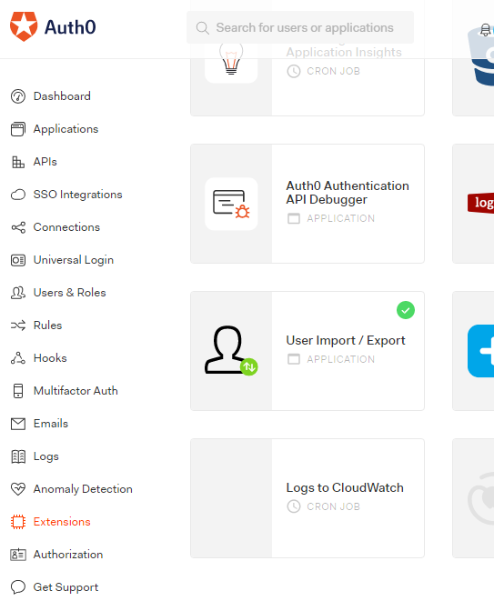
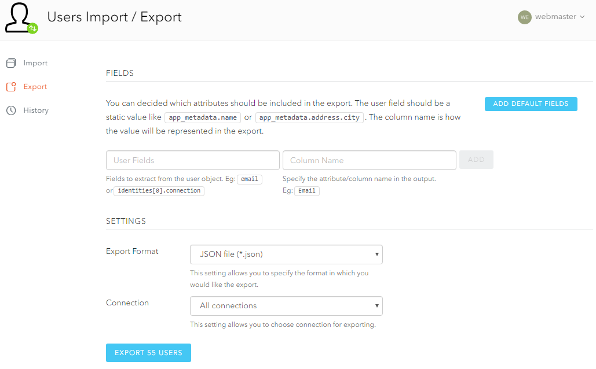
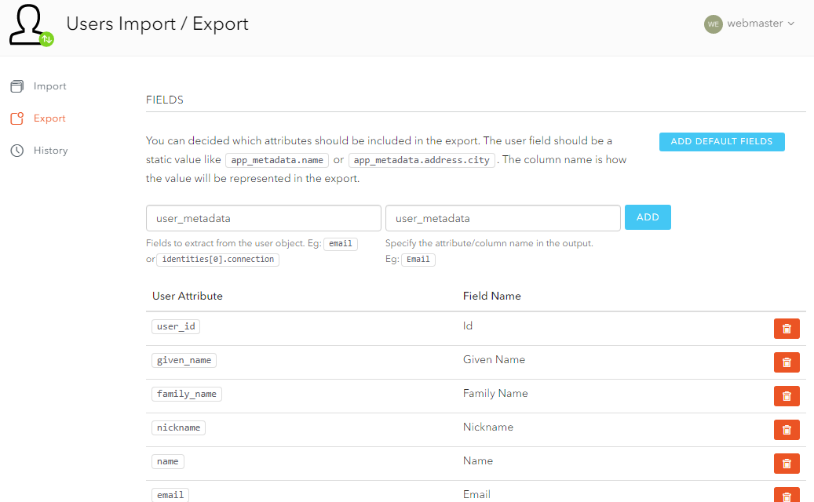
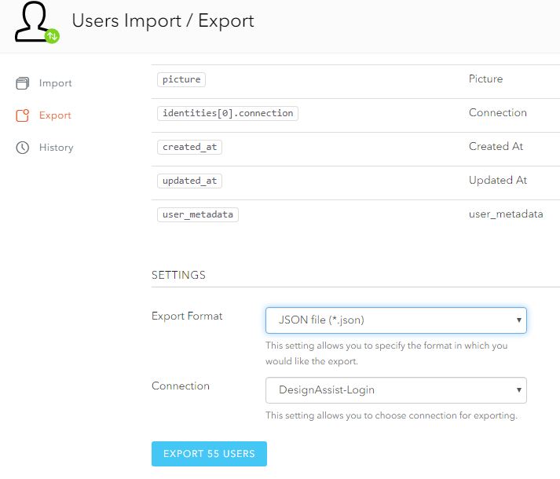

## Extensions

To rebuild the database using the existing Auth0 users, we can simply import the users as JSON as opposed to adding everyone individually. 

In the Auth0 dashboard, go to the *Extensions* link in the left sidebar, scroll down, and click *User Import/Export*. This will take you to another page where you will likely have to log into Auth0 again.

____
You will see the following when you click *Export*:
____

## Adding fields

Before you export the users, you want to 

1. Click *ADD DEFAULT FIELDS*
2. Add the custom field of *user_metadata*, which should contain the Stripe customer id

## File format

After adding the custom field described above, scroll down and you will see the following. Make sure that the file format is JSON and the connection is DesignAssist-Login. After clicking "Export", you should place it in your `ShinyApps/user_files/` folder with the name `webmaster.json`. 

We currently have the `makeDB.py` function generate users based on a JSON format. 
Exporting the users will download a JSON file that we will use to generate the database. Again, this only needs to be done if for some reasons the database is rebuilt. In general, we should not need to perform these actions. 