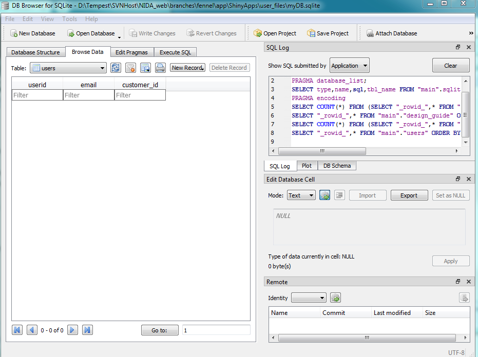

## Make the database 

The code for making the blank database shown here is part of the file `app/ShinyApps/user_files/makeDB.py`. Note that it creates a database called `myDB.sqlite`. To run it, open Python and type

```python
import makeDB
makeDB.makeDB()
```

This will create a completely empty database, with the relevant tables. 



### makeDB() function
```python
import sqlite3 as sql   # create a database
import re, json, datetime

DBNAME = 'myDB.sqlite';

def makeDB():
    global DBNAME
    conn = sql.connect(DBNAME)
    conn.execute('pragma foreign_keys=ON')        # this is necessary to use foreign keys / references
    c = conn.cursor()
    
    # create table with "global" fields: {id, email, customer_id}
    c.execute(''' CREATE TABLE users(
        userid      TEXT NOT NULL, 
        email       TEXT,
        customer_id TEXT,
        PRIMARY KEY (userid),
        UNIQUE(userid)
    )''')
    
    # create table with fields: {id, name}
    c.execute(''' CREATE TABLE project(
        project_name    TEXT,
        userid          TEXT NOT NULL, 
        created         TEXT,
        FOREIGN KEY(userid) REFERENCES users(userid) ON UPDATE CASCADE ON DELETE CASCADE
    )''')
    
    # create table with design guide data
    c.execute(''' CREATE TABLE design_guide(
            userid          TEXT NOT NULL,
            project_name    TEXT,
            data            BLOB,
            FOREIGN KEY(userid) REFERENCES users(userid)
    )''' )
    
    # create table with design guide data
    c.execute(''' CREATE TABLE design_guide_temp(
            userid          TEXT,
            data            BLOB,
            FOREIGN KEY(userid) REFERENCES users(userid)
    )''' )
    
    # create table with sample size tool data
    c.execute(''' CREATE TABLE samplesize(
            userid          TEXT NOT NULL,
            project_name    TEXT,
            data            BLOB,
            FOREIGN KEY(userid) REFERENCES users(userid)
    )''' )
    
    # create table with power size tool data
    c.execute(''' CREATE TABLE powersize(
            userid          TEXT NOT NULL,
            project_name    TEXT,
            data            BLOB,
            FOREIGN KEY(userid) REFERENCES users(userid)
    )''' )
    
    # create table with graph stuff
    c.execute(''' CREATE TABLE graph(
            name            TEXT,
            userid          TEXT NOT NULL,
            project_name    TEXT,
            data            TEXT,
            FOREIGN KEY(userid) REFERENCES users(userid)
    )''' )
    
    conn.commit()
    conn.close()
```
This first function (above) creates the database with a few tables. The part of the file detailed in [the section below](#json-init) has functions that actually take the Auth0 JSON data and insert that into the database after creation.

Note the `FOREIGN_ KEY` requirement. This means that the data is dependent on data from other table via `REFERENCES`.


## Add new users

When a new Stripe customer is created, an entry is added to the database through `pyhelp/auth0_controller.py` under the function `create_user()`. 