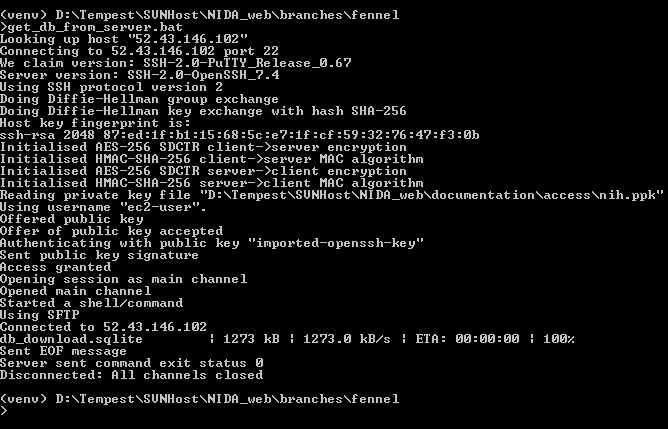
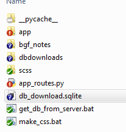

# Saving and Maintaining the Database

!> The database is just like any other file, with one major exception: it is a living document for our users.

For that reason, about every few days -- and especially before a big commit -- I will download the 
database from the server. The way I do this is through *pscp*, the PuTTY Secure Copy client.

https://www.chiark.greenend.org.uk/~sgtatham/putty/latest.html

The steps below are needed before you start deploying to Elastic Beanstalk.


# Getting the database from the server

There is a batch file in the main branch called `get_db_from_server.bat`. It uses *pscp* to securely get the database file. 

## Batch File
The contents of the file are given below. Essentially, we need a .ppk file (generated by AWS) to get access, the password to access it (*tempest208*), and the file location. The thing **you** need to change is the `PPK_LOC` variable. Set it to wherever your `<repo>/documentation/access` folder is. 

```dos
@echo off

REM ------------------------------------------------------------------------------------------
REM     The purpose of this file is to download the database directly from the AWS server 
REM     using the command line instead of the WinSCP interface. The reason we might need 
REM     this is to periodically check the database and recover from any potential errors.
REM
REM     (Note: replace with the location of your .ppk credentials file)
REM 
REM     If there ever is a "timed out" error, check the EC2 inbound rules to allow port 22 access
REM ------------------------------------------------------------------------------------------

SET APP_LOC=/opt/python/current/app

REM  With PSCP, we can pass the password. With SCP, a user interface for password entry is required.
REM  Note that the key file needs its extension here (and not with the SCP command).

SET USERCONN_live=ec2-user@52.43.146.102
SET USERCONN_beta=ec2-user@52.10.181.165

SET USERCONN=%USERCONN_live%
SET PPK_LOC=D:\Tempest\SVNHost\NIDA_web\documentation\access

pscp -v -i %PPK_LOC%\nih.ppk -pw tempest208 %USERCONN%:%APP_LOC%/ShinyApps/user_files/database.sqlite ./db_download.sqlite
```

You should only need to double-click this file (assuming *pscp* is in your path) to run it and grab the database from the server. 



You will see that a new file is added, called *db_download.sqlite*.




# Replace the existing file

Next, move this file to `app/ShinyApps/user_files/` and replace `database.sqlite` with this file by renaming the new file. 


# Commit to the repository

Finally, commit the updated file to the repository. Additionally, I keep a non-versioned folder that has several copies of the database at various time points. 


