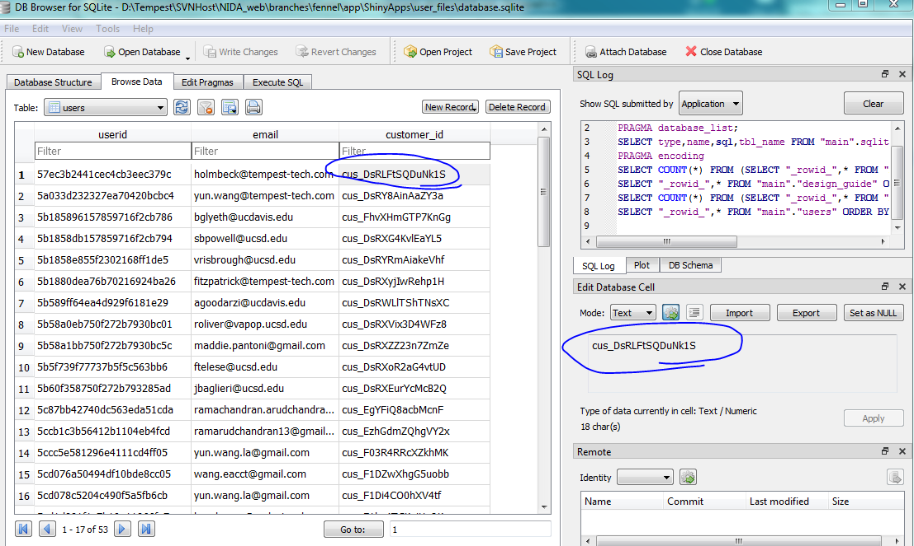
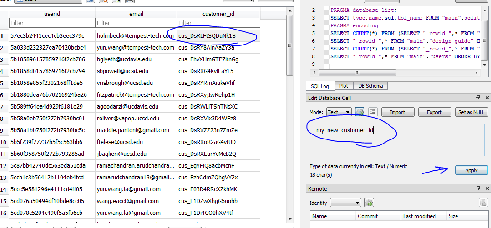
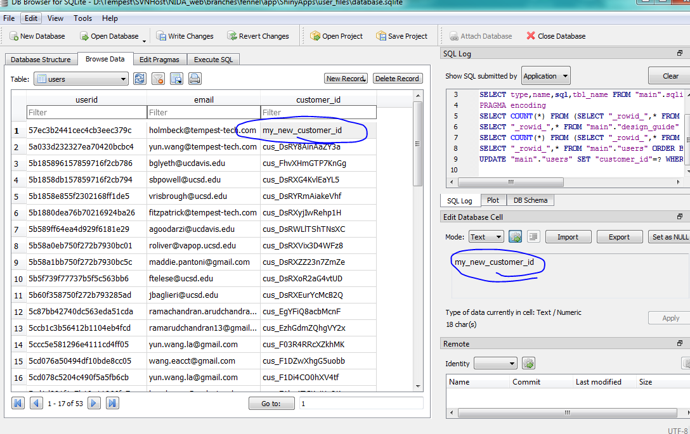

# Editing the Database

# Why? - An Example

We recently had an example where the database was uploaded with the incorrect Stripe user information. For this reason, I went into the database directly and simply edited the necessary field. In this case, I was able to edit it using the DB Browser. Below I will show that method, but will also include how to do it in Python.


# DB Browser
## Open the Database




## Edit the field
In the right side, you can edit the field directly. Press **APPLY** to apply the changes.




## The field is now updated!

See that the table (on the left) now reflects what we typed in after pressing **APPLY**.




## Write the changes

Click **WRITE CHANGES** to actually change the repository. 


## Commit the changes

In order to change the actual repository (e.g. to deploy it to the site), you need to commit the changes (by replacing the database file database.sqlite on AWS with the update local database.sqlite)!


_________

# sqlite3

All of the following assumes you have opened Python and imported sqlite3

```python
import sqlite3
```

## Open the Database

```python
conn = sqlite3.connect('database.sqlite')
cur = conn.cursor()
```

## Edit the field

You need to identify the person you're editing. Since the emails are all unique (for now), this example just uses the email setting. You could also use the unique Auth0 user_id. 

```python
cur.execute("UPDATE users SET customer_id=? WHERE email=?", ("my_new_customer_id", "holmbeck@tempest-tech.com"))
```

## The field is now updated!

See that the table (on the left) now reflects what we typed in after pressing **APPLY**.

```python
cur.execute("SELECT * FROM users WHERE email=?", ("holmbeck@tempest-tech.com",))
row = cur.fetchone()
print(row)
>>> ('57ec3b2441cec4cb3eec379c', 'holmbeck@tempest-tech.com', 'my_new_customer_id')
```


## Write the changes

Just as in DB Browser, we need to write / commit the changes. 

```python
conn.commit()
conn.close()    # don't forget to close the database
```

## Commit the changes

In order to change the actual repository (e.g. to deploy it to the site), you need to commit the changes (by replacing the database file database.sqlite on AWS with the update local database.sqlite)!

