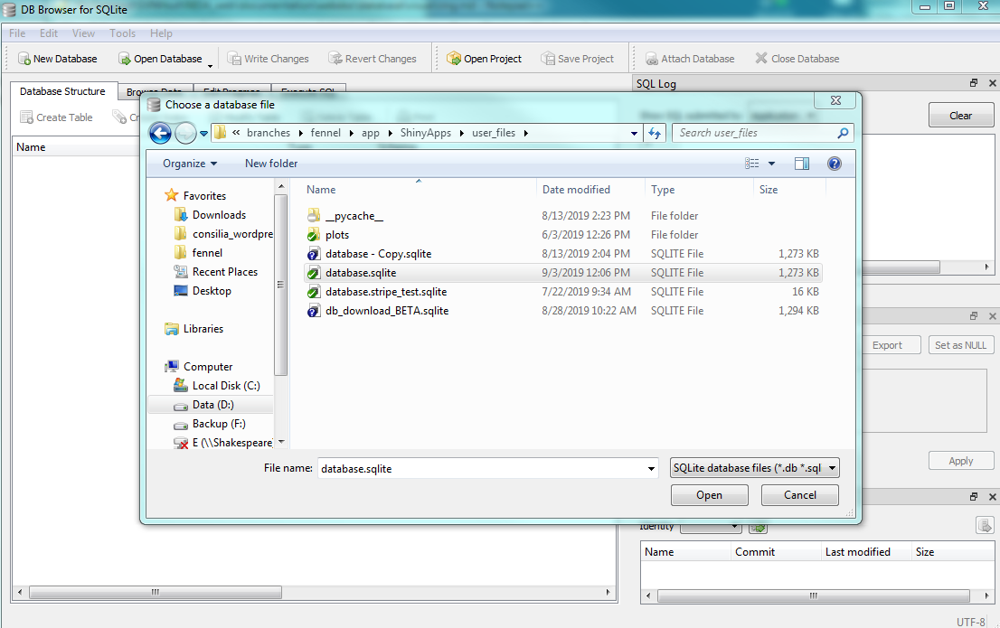
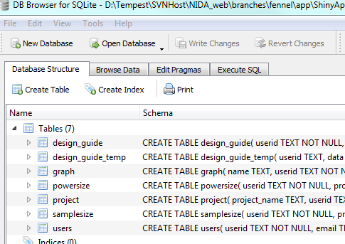
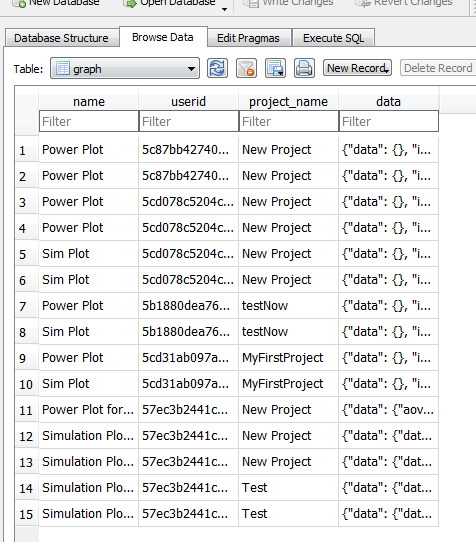
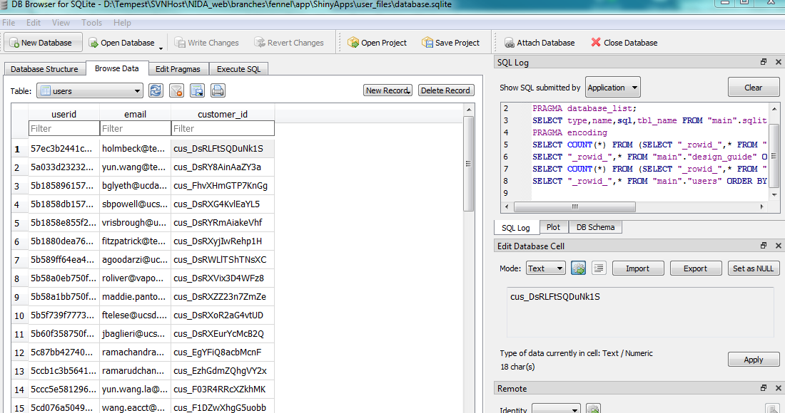

# Visualization

There are several apps for navigating and inspecting the database. The app we use for demonstration is [DB Browser for SQLite](https://sqlitebrowser.org/). 

# Install DB Browser for SQLite
The DB Browser can be found at link https://sqlitebrowser.org/dl/ for download. Once download completed, you can double-click the program to install. The programe name is `DB Browser for SQLite.exe` resides in `C:\Program Files\DB Browser for SQLite\`.

# View database

To open a database, run `DB Browser for SQLite.exe` by clicking the app, and click File > Open Database and choose a database, e.g. database.sqlite in app\ShineyApps\user_files\, to view.

# Navigate DB Browser
## Top-level data
After opening a database, we can view the top-level data:

## Specific table data
We can also dive into the data for a specific table (`graphs` table shown below, for example)

# Edit data

You can also use DB Browser to directly edit data (with the caveat that it is not `FOREIGN_KEY` data. See makeDB.py for some information).

