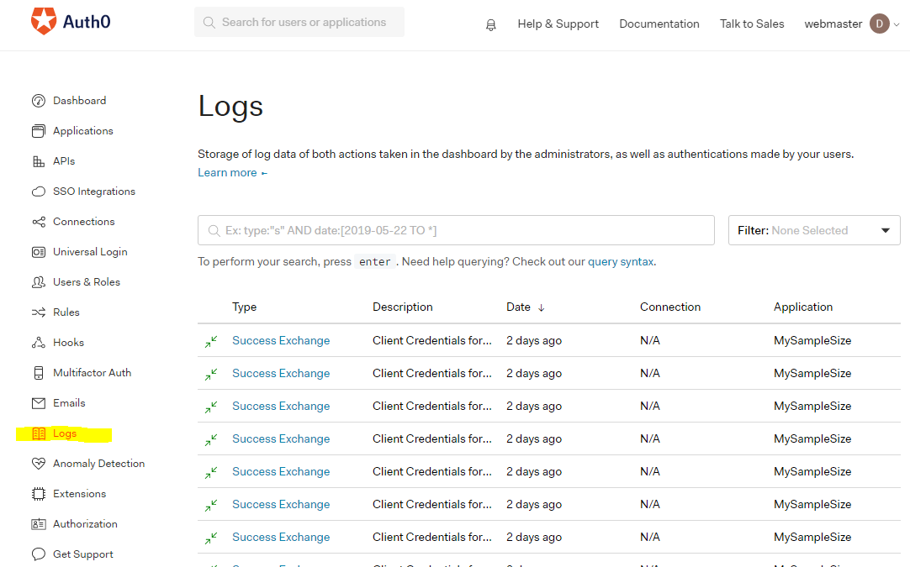

# Auth0

Since Auth0 is a third-party extension, we rely on the Auth0 logs for debugging.

!> Auth0 logs are only available for a limited time period, two days. 

You cannot access logs from last week, for example, so if there are errors we may need to log in frequently and check them or run some sort of bot to fetch these logs. 

Log into Auth0 with the Tempest Google account at manage.auth0.com. Use the sidebar to navigate to the logs. 

# Log Data 



# Detailed Data

From here, you can click on each action and view the details. Below, we have a log for a successful user login.


# Raw log data

At the bottom, you can see a text box full of information about the login. This is called the raw data. A set of data is shown below so you know what you might expect: a lot of information.

```
{
  "date": "2019-09-03T22:47:27.651Z",
  "type": "s",
  "connection": "DesignAssist-Login",
  "connection_id": "con_W7DTLVWHvY5StUip",
  "client_id": "UPFaWcmXQaUGHmx9XRDHdi3UGGY5gkbu",
  "client_name": "MySampleSize",
  "ip": "108.93.193.168",
  "user_agent": "Chrome 76.0.3809 / Windows 7.0.0",
  "details": {
    "prompts": [
      {
        "name": "prompt-authenticate",
        "completedAt": 1567550846247,
        "connection": "DesignAssist-Login",
        "connection_id": "con_W7DTLVWHvY5StUip",
        "strategy": "auth0",
        "identity": "5b1880dea76b70216924ba26",
        "stats": {
          "loginsCount": 254
        },
        "elapsedTime": null
      },
      {
        "name": "login",
        "flow": "universal-login",
        "initiatedAt": 1567550839791,
        "completedAt": 1567550846251,
        "timers": {
          "rules": 1373
        },
        "user_id": "auth0|5b1880dea76b70216924ba26",
        "user_name": "fitzpatrick@tempest-tech.com",
        "elapsedTime": 6460
      }
    ],
    "initiatedAt": 1567550839785,
    "completedAt": 1567550847649,
    "elapsedTime": 7864,
    "session_id": "g0nfQAwbBuORi4PI0cucPH0Xqwv2RXDr",
    "device_id": "v0:9266cf80-c9ac-11e9-9f6c-3fcd0b6c086a",
    "stats": {
      "loginsCount": 254
    }
  },
  "hostname": "webmaster.auth0.com",
  "user_id": "auth0|5b1880dea76b70216924ba26",
  "user_name": "fitzpatrick@tempest-tech.com",
  "strategy": "auth0",
  "strategy_type": "database",
  "log_id": "90020190903224732224000061067525323022642279127151804514",
  "_id": "90020190903224732224000061067525323022642279127151804514",
  "isMobile": false,
  "description": "Successful login"
}
```
