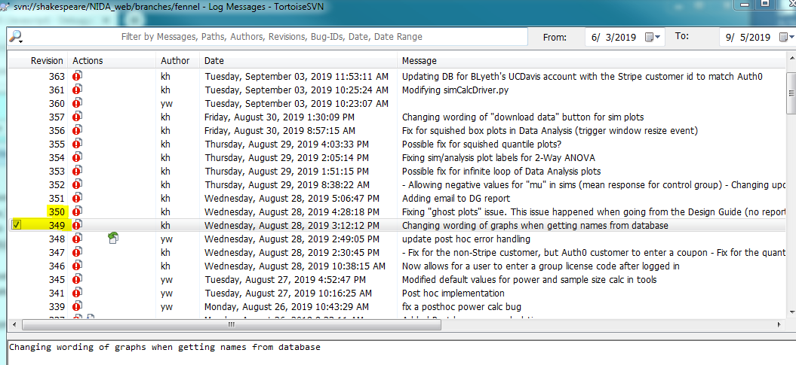
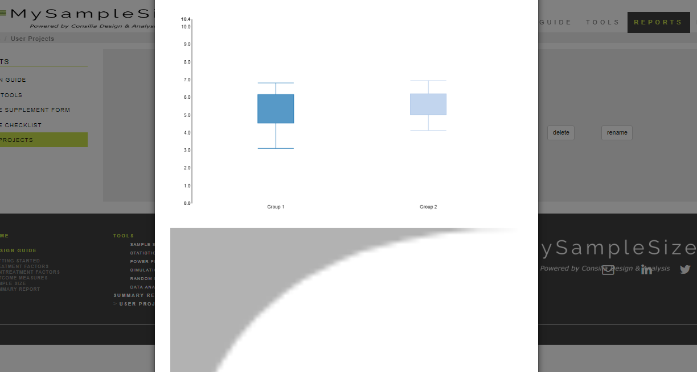
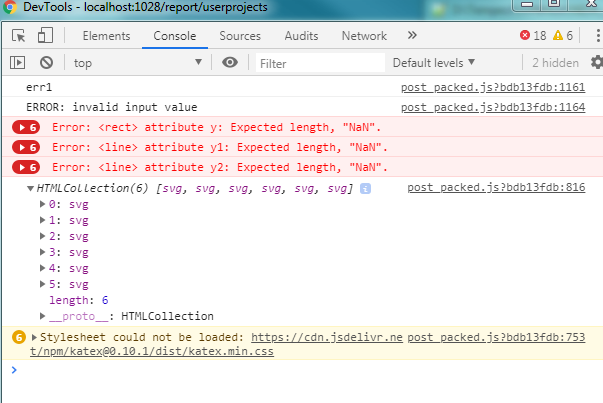
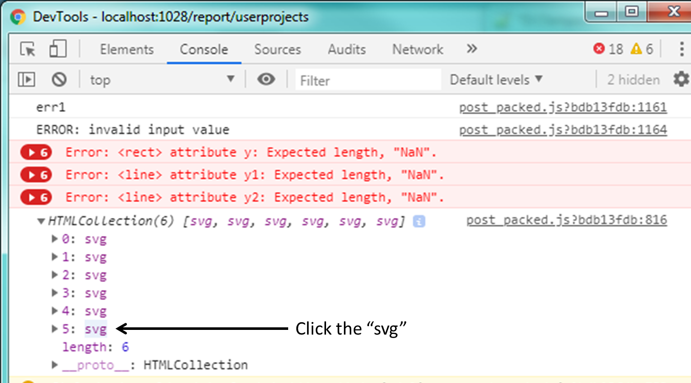
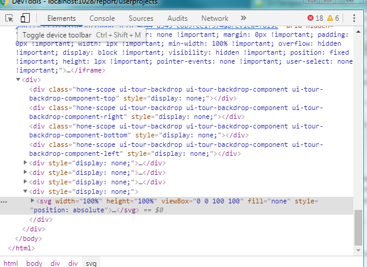
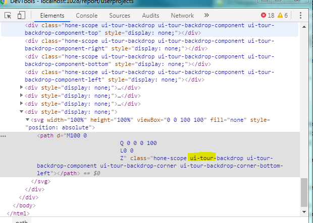
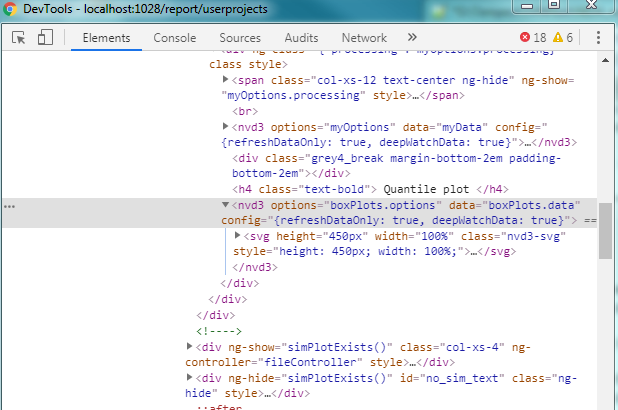

# Javascript Debugging


# console.log()

The method I use for figuring out what's happening in Javascript varies, but it always culminates in printing stuff to the developer console, which can be opened in most browsers by pressing `F12`. 

# AngularJS: $watch

Read more here: https://docs.angularjs.org/api/ng/type/$rootScope.Scope#$watch

Suppose we have a controller initialized as it is below:

```javascript
app.controller("myController", ['$scope', function($scope){
    $scope.myVariable = 123;    // initialize the variable
    
    // code does other stuff
}]);
```

In Angular, there is something called a `watcher`. When a variable that you bind in HTML is changed in Javascript, the HTML should update with the correct value. In addition, we might want to perform an action after a variable is updated. This is when watchers can be used to do something everytime the **scope** variable changes. See below.

```javascript
app.controller("myController", ['$scope', function($scope){
    $scope.myVariable = 123;    // initialize the variable
    
    // adding a watcher for "$scope.myVariable"
    $scope.$watch('myVariable', function(newVal, oldVal){
        if( newVal !== oldVal ) {               // the variable changed
            console.log("variable changed");    // prints to developer console
        }
    });
    
    // code does other stuff
}]);
```

My point is, if something isn't behaving as expected, try "watching" the variable to see what's happening. This debugging method is not commonly used.


# POST data

Sometimes we have unexpected results after requesting data from the server. Recall that a data request looks like, for example:

```javascript
app.controller("myController", ['$scope', '$http', function($scope, $http){
    
    $scope.dataToSend = {
        key1: "value1",
        key2: "value2"
    };
        
    $http({
        method: 'POST',
        url: '/python_flask_endpoint',
        data: $scope.dataToSend,
        headers: {'Content-Type': 'application/json'},  // it will get sent as JSON data 
    }).then(function successCallback(response) {
        // the "response" variable has info on headers; we never really use it
        var dataBack = response.data;
        
        console.log( dataBack );    // view what's in the data sent back 

        // do stuff with the data here
        
    }, function errorCallback(response) {
        // You should not encounter this, but it's good to know it's here
        // so that we can capture server errors.
        console.log("A server error occurred!")
    });
    
}]);
```

____________
# Example: extra plots

There was an issue recently with extra plots showing up in the report. I will go through how I was able to pinpoint the problem and solve it.




## Steps to reproduce :id=steps

!> Use repo version **349** on the fennel branch.

1. After logging in, navigate to the DesignGuide. 
2. Go to Tools > Simulations
3. Save your plots

After performing these steps, when we view the report, we will see some extra plots show up that do not belong. 



I did not detect this initially because I only tested by creating the plots, not by going to the DesignGuide first! BGF detected the issue and the steps to reproduce this issue.

!> This only happened after navigating to the DesignGuide page. 

In `saveToolsController.js`, we have a function to count up all the existing plots and save them. I put in a console statement here to verify that it indeed was counting extra plots.

```javascript
function savePlots()
{
    // These next few lines are needed for saving plot data to the database
    var svgElements = document.getElementsByTagName("svg");

    console.log('nSVG elements:', svgElements.length );     // output for 1-Way ANOVA: 6. We expect only 2.
    
    var dataURI = new Array(svgElements.length);
    
...
```

## Number of SVG elements
The expected number of simulation plots for a 1-Way ANOVA, for example, is two - one simulation plot and one quantile plot. The `var svgElements = document.getElementsByTagName("svg");` line was counting 6. That is, there were six `svg` elements existing in the HTML. Very peculiar...

Next, I modified the console.log statement to actually display the elements.

```javascript
function savePlots()
{
    // These next few lines are needed for saving plot data to the database
    var svgElements = document.getElementsByTagName("svg");

    console.log( svgElements ); // print the elements to the console
    
    var dataURI = new Array(svgElements.length);
    
...
```

## Print the elements
I refreshed the page and followed the [Steps](#steps). The console output was:



## Display the offending element(s)
Since the extra plots were appended at the end, I clicked the last one. 



This leads to the location of the element in the console (on the Elements tab of the console).



## ui-tour??
When I expanded the element to view the inner HTML, I noticed that its classes had ui-tour in them. I do not assign these, so I figured that something with ui-tour (which is used in the DesignGuide) made SVGs. 




## Resolving: modify saveToolsController.js

So counting every single SVG is not the proper solution to saving the plots we need. Using the inspector, I know (and can see) that the plots are created using nvd3. The SVG elements we want are children of the nvd3 elements.



Instead of 

```javascript
var svgElements = document.getElementsByTagName("svg");
```

We will first find the **nvd3** elements, then get the svg elements from those. 

Our code then becomes (cut for brevity):

```javascript
function savePlots()
{
    //var svgElements = document.getElementsByTagName("svg");   // original code
    
    var nvd3Elements = document.getElementsByTagName("nvd3");   // added code

    var dataURI = new Array(nvd3Elements.length);
    var options = {scale: 0.75, canvg:window.canvg};
    
    var getUriData =  function(index) {
        var def = $q.defer();
        
        //var svgCanvas = svgElements[index];   // original code
        
        // added code: get the svg element here
        var svgCanvas = nvd3Elements[index].getElementsByTagName("svg")[0];
        
        svgAsPngUri(svgCanvas, options, function(uri2) {
            dataURI[index] = uri2;
            def.resolve();
        });
        return def.promise;
    };
    
    ...
```        


