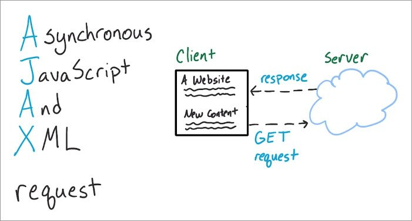

<!-- ## Introduction

Welcome to a subset of the documentation for [MySampleSize](https://www.mysamplesize.com ':target=_blank')! 

!> This documentation addresses the interface between the JavaScript (JS) code and the server (Python/Flask). -->

# HTTP  Interface

Learn about the interface between the JavaScript (JS) code and the server (Python/Flask).

In general, we are discussing the relationship between AngularJS controllers and services. The overarching idea lies in AJAX requests, which allow us to "talk" to the server to get data (e.g. power and sample size calculations).

With Ajax, web applications can send and retrieve data from a server asynchronously without interfering with the display and behavior of the existing page and you can:
 
    * Read data from a web server - after a web page has loaded
    * Update a web page without reloading the page
    * Send data to a web server - in the background

### HTTP
**HTTP** stands for Hyper Text Transfer Protocol

**WWW** is about communication between web clients and servers. Clients are often browsers (Chrome, Edge, Safari), but they can be any type of program or device. Servers are most often computers in the cloud.

Communication between client computers and web servers is done by sending HTTP Requests and receiving HTTP Responses

HTTP is a set of protocols designed to enable communication between clients and servers. It works as a request-response protocol between a client and server.
A web browser may be the client, and an application on a computer that hosts a web site may be the server.
__________________________
HTTP Request / Response

Communication between clients and servers is done by requests and responses:

    1. A client (a browser) sends an HTTP request to the web
    2. An web server receives the request
    3. The server runs an application to process the request
    4. The server returns an HTTP response (output) to the browser
    5. The client (the browser) receives the response
_________________________
The HTTP Request Circle

A typical HTTP request / response circle:

    1. The browser requests an HTML page. The server returns an HTML file.
    2. The browser requests a style sheet. The server returns a CSS file.
    3. The browser requests an JPG image. The server returns a JPG file.
    4. The browser requests JavaScript code. The server returns a JS file
    5. The browser requests data. The server returns data (in XML or JSON).
_________________________________
So, to request a response from the server, there are mainly two methods:

    GET : to request data from the server.
    POST : to submit data to be processed to the server.

Here is a simple diagram which explains the basic concept of GET and POST methods.

References:
   - [https://www.geeksforgeeks.org/get-post-requests-using-python/](https://www.geeksforgeeks.org/get-post-requests-using-python/)
   - [https://www.w3schools.com/whatis/whatis_http.asp](https://www.w3schools.com/whatis/whatis_http.asp)

## Outline
This documentation can be broken down into the following parts:

1. AngularJS
    - [HTML routes for user navigation](routes.js)
    - [Controllers, services, and how they are connected on our site](controllers_and_services/versus)
    - [Controllers and services that call the Flask server](js_http)
2. Python
    - [Interface routes called by AngularJS](routes.py)
    - [Support functions called by interface functions that do the bulk of the heavy lifting for calculation](py/by_file)
3. Debugging
    - General tips for debugging both [AngularJS](js_debug) and [Python](py/debug)

## Searching
In the upper left corner of the window, there is a search box. It's not great, but it's better than nothing.

<!-- an example of including a file 
    [filename](test.md ':include')
-->