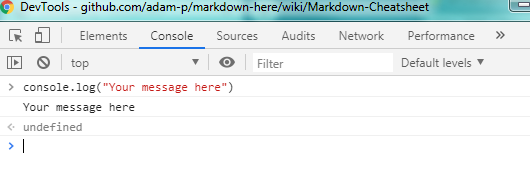

# Debugging JavaScript

In order to place a debug or print statement in JavaScript, use 

```javascript
console.log("Your message here")
```

in the JavaScript code to display a message in the developer tools (F12) console.



The developer tools can also show when an HTTP request is successful or not, other error or information data, and even network information. 

!> Using the console is essential to JavaScript and AngularJS debugging.