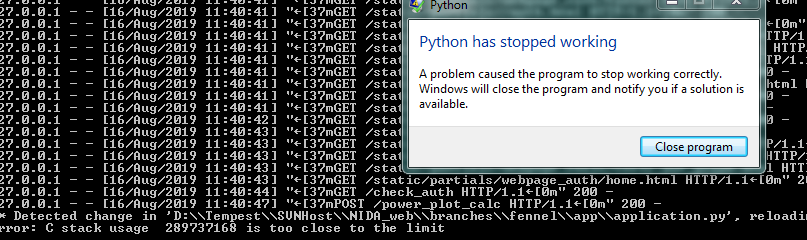

# Debugging Python code

## Indentation
!> The first thing you should know is that **Python is indent-sensitive**. 

Indenting lines is what tells Python the scope of the code. In MATLAB, this is done by `end` statements. In JS, this is done by brackets (`{ <code> }`). Furthermore, the use of tabs and spaces cannot be mixed. All the code should have spaces instead of tabs. Replacing tabs with spaces can be configured on your text editor.

## Basics
In general, Python provides the builtin `print()` function to print output to the console. This can be useful when developing standalone and JS interface functions, but if you have a long `dict()` object, it will print everything as a single line.

In addition to printing, you can use
```python
import pdb
pdb.set_trace()
```

to add a MATLAB-like `dbstop` statement to any line (where the above statement is placed) in the file. There are single-character commands that allow you to move throughout the debugging process, as outlined in the table below.

|  Command |  Action  | Description
| ------   | --------- | ---------
| `n` | **Next** | execute the current line and move to the next line
| `s` | **Step** | execute the current line, stop at the first possible occasion (either in a function that is called or on the next line in the current function). Sort of equivalent to MATLAB `dbstep in`
| `r` | **Return** | Continue execution until the current function returns
| `c` | **Continue** | Continue execution, only stop when a breakpoint is encountered
| `j <lineno> ` | **Jump** | Set the next line that will be executed. This lets you jump back and execute code again, or jump forward to skip code that you don’t want to run.
| `p` | **Print** | Evaluate the expression in the current context and print its value
| `q` | **Quit** | Quit the debugger


## try-except

You may notice that I have placed a significant amount of `try-except` (a.k.a. try-catch) lines in the Python code. The purpose of this is to capture the error to display to the user, but in debugging it can be a hindrance to determine which exact line causes the error. My suggestion is to comment out the try-except so an error is thrown *and* you know where the error is coming from. 

## Issues

Since we are still using R for the power plot calculations, modifying most of the Python code will trigger a Flask update, which generates errors.



There is no remedy -- simply restart Python and move on. I've noticed that if the [/power_plot_calc](../routes.py#power_plot_calc) endpoint is never called, then this does not happen. Once it is called (either in [tools.pwrgraph](../routes.js#tools.pwrgraph) or [design_guide](../routes.js#design_guide)) then this error will occur on Python modification/reload.
