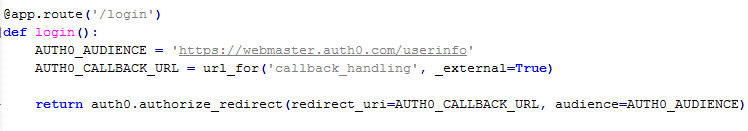
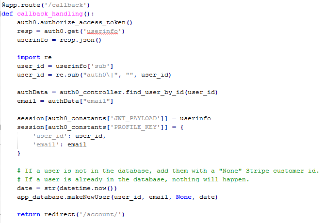
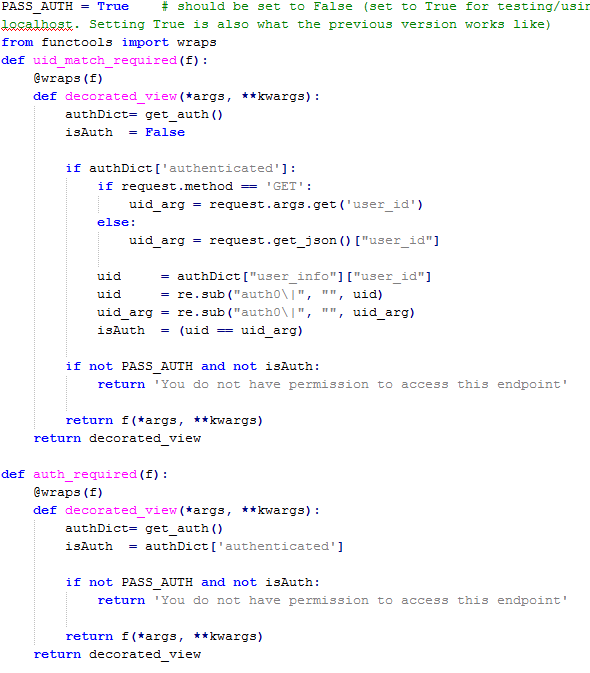
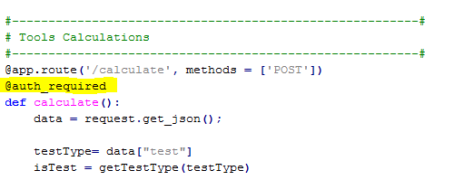
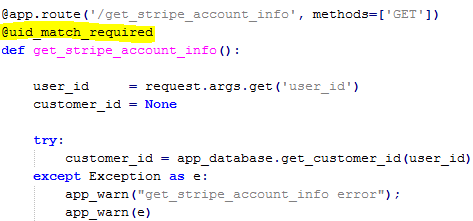
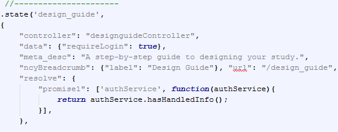
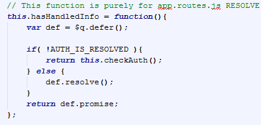
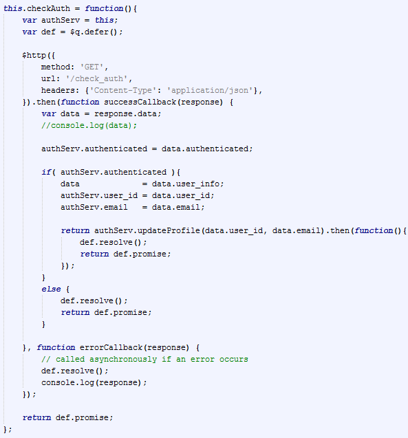

<!-- # Welcome

The purpose of this section of the documentation is to go over how pages are secured to prevent unwanted user access. In this case, a user is any site visitor. We will used "authorized user" to indicate a visitor who has registered through us with Auth0. -->
# Securing Pages

Learn about how pages are secured to prevent unwanted user access. In this case, a user is any site visitor. We will used "authorized user" to indicate a visitor who has registered through us with Auth0.


# AngularJS vs Python

Python can serve pages via Flask, but the main thing to note for this is that we predominantly use Python as a backend server. That is, the endpoints (urls) are not accessed by opening an HTML page, but rather through server requests.

On the other hand, AngularJS is used for the bulk of the user interface for our site. The way we've found to protect pages is through constantly asking the Python server if the user is authenticated, and changing a JS variable based on the answer. 

_______________


# Protecting Python Routes

First, why do this? Although it's not a necessity, if a user knows the proper parameters and endpoint, they can 
access the tools calculators or authorized user data without being logged in. The chances of this occurring are 
rare, but it's important to know that it could happen. To that end, we have chosen to protect those routes with a 
Flask *decorator*.

## Flask Decorators
The following excerpt is from [this](https://flask.palletsprojects.com/en/1.1.x/patterns/viewdecorators/) page.

> Python has a really interesting feature called function decorators. This allows some really neat things for web applications. Because each view in Flask is a function, decorators can be used to inject additional functionality to one or more functions. The route() decorator is the one you probably used already. But there are use cases for implementing your own decorator. For instance, imagine you have a view that should only be used by people that are logged in. If a user goes to the site and is not logged in, they should be redirected to the login page. This is a good example of a use case where a decorator is an excellent solution.

In one sentence, view decorators are used to perform actions before the endpoint is accessed.

In order to show the current application's use of decorators, I need to talk about the information we obtain from Auth0 before discussing how it's used in the decorator.


## Auth0 Flow and Data

!> For reference to how the Python code addressed in this section comes from, check out this link: https://auth0.com/docs/quickstart/webapp/python/01-login. Note that all the Python code is contained in application.py.

When a user signs into our website, they do so through a third-party application: Auth0. After Auth0 verifies the user has the correct email and password, they are redirected back to our site at an endpoint we specify. In the Python code below (which is in application.py), we tell Auth0 to redirect to the url for 'callback_handling', a Python route we created.



The *callback_handling()* function is shown below. What is does is:

1. Gets a unique [access token](https://auth0.com/docs/tokens/access-tokens) generated by Auth0 to allow us to access the API
2. Retrieves some user information from Auth0
3. Saves the session information to a local Python variable
4. (Optional:) makes a new user in the database if the Auth0 user id is not found in the database
5. Redirect to the user's account page



!> The session information saved will be used in the decorator [later](#get_auth).

## Back to the decorators

First, let's look at the code for both decorators;



The first thing to note is the `PASS_AUTH` variable. It should be set to False, meaning check for authentication, but I often set it to true when working on localhost and disabling the login functionality. In other words, don't worry about this variable.

Note that both decorators call the function [`get_auth()`](#get_auth).

### `get_auth()`

Remember in the previous section where we talked about "*session*" information? Here is one place it's used. The get_auth() function provides a simple boolean response to whether or not a user has logged in through Auth0.

```python
def get_auth():
    if auth0_constants['PROFILE_KEY'] not in session:
        retval = {'authenticated': False}
    else:
        retval = {'authenticated': True, 'user_info': session[ auth0_constants['PROFILE_KEY'] ]}
    
    return retval
```

Knowing this, let's continue on with the code .

### `auth_required`
We'll start by taking a look at the simpler one of these two decorators.

```python
def auth_required(f):
    @wraps(f)
    def decorated_view(*args, **kwargs):
        authDict= get_auth()
        isAuth  = authDict['authenticated']

        if not PASS_AUTH and not isAuth:
            return 'You do not have permission to access this endpoint'
        
        return f(*args, **kwargs)
    return decorated_view
```

This code checks the session information (through get_auth()) to see if is the user is authenticated or not. If the user is, the `return f(*args, **kwargs)` essentially passes through as it would normally. If the user is not authenticated, the return statement "You do not have permission" is passed instead and access to any endpoint decorated with this view fails.

An example of this is in the "/calculate" endpoint for the backend power and sample size calculations. If a user is not logged in, they cannot access this endpoint. See the image below for how the `auth_required` decorator is used.




### `uid_match_required`
The other decorator is a little bit more involved. It says: not only do you have to be logged in, but your user id provided must match that which is registered with the system. 

When would something like this happen? An example is like below: you can call "*/get_stripe_account_info*" by providing the user id you wish to enquire about. However, without the decorator, you could technically get information about any user, provided that you had their Auth0 user id. 



As far as the actual code, here it is:

```python
def uid_match_required(f):
    @wraps(f)
    def decorated_view(*args, **kwargs):
        authDict= get_auth()
        isAuth  = False
        
        if authDict['authenticated']:
            if request.method == 'GET':
                uid_arg = request.args.get('user_id')
            else:
                uid_arg = request.get_json()["user_id"]
            
            uid     = authDict["user_info"]["user_id"]
            uid     = re.sub("auth0\|", "", uid)
            uid_arg = re.sub("auth0\|", "", uid_arg)
            isAuth  = (uid == uid_arg)
        
        if not PASS_AUTH and not isAuth:
            return 'You do not have permission to access this endpoint'
        
        return f(*args, **kwargs)
    return decorated_view
```

What the code above does:

1. As I mentioned earlier, first we need to make sure the user is logged in using the *get_auth()* function. 
2. If they are, then we need to get their Auth0 user id, which should be provided as an argument when Javascript calls the endpoint. Since JS can call the server using a "GET" or "POST" method, there are two possible ways to do so, which is where `uid_arg` is assigned in the `if-else` statement.
3. Next, we get the session information (saved after a login from Auth0; see [previous section](#auth0-flow-and-data) for more details) which contains the user id registered at the time.
4. If the session id and the provided id match, then we can proceed with the route in question. If they do not match, then route access fails.


_______________


# AngularJS Routes

AngularJS is considered a Single-Page Application (SPA) in that it appears to contain multiple, separate webpages that are in fact all part of the same page. In traditional AngularJS, the web urls differ by a hash (\#). Browsers interpret the hash as a link on the same page. 

To further obfuscate the true behind-the-scenes of AngularJS, we can turn off the appearance of the hash by a configuration variable (in app.js). The point of all this information is that we need to handle AngularJS routes different from Python routes. 

## app.routes.js

We will look at one example in the app.routes.js file as they all function the same.



The "resolve" field allows us to have multiple "promises": that is, things to do before AngularJS serves the route to the end user. From [the docs](https://docs.angularjs.org/api/ngRoute/provider/$routeProvider):

> resolve - An optional map of dependencies which should be injected into the controller. If any of these dependencies are promises, the router will wait for them all to be resolved or one to be rejected before the controller is instantiated. 


## authService

You can see from the "resolve" in the Design Guide route, we check the function `hasHandledInfo` from `authService`.



Which in turn calls `check_auth` from the service. The `check_auth` function calls Python and gets the session information that we discussed earlier to return back to AngularJS. 



So everytime the Design Guide page is requested, these actions happen. In fact, for every authorized page, the same set of steps occur. This brings us to eventually say: yes, the user is authenticated, or not. The answer then serves a different page, depending on the answer. 

_______________


# Conclusion

We protect Python routes with decorators, and AngularJS routes by resolving promises before page access. 
