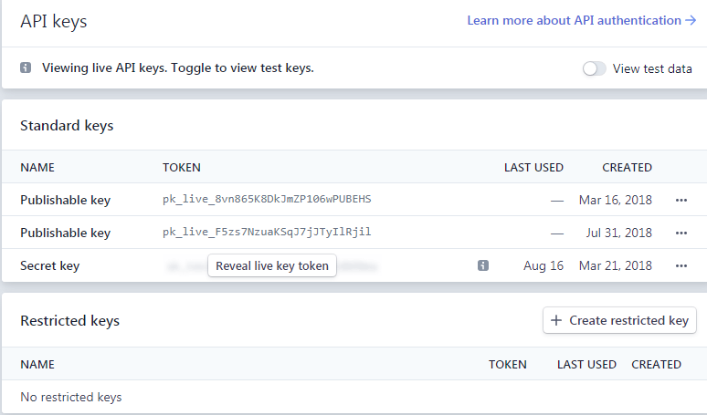

# API

The Stripe API is how we interface Python to access Stripe. In our current setup, this is accomplished through `pyhelp/stripe_payments.py`. The full details of the API can be accessed at https://stripe.com/docs/api.

## Access {docsify-ignore}

For access to most APIs a *key* is needed. This key tells Stripe (e.g.) that the accessor is legitimate. Our specific keys can be found at https://dashboard.stripe.com/apikeys (after logging in).

## Outline {docsify-ignore}

In this section, the basic concepts are:
* Accessing customer data
* Applying payments
* Accessing subscriptions
* Viewing different products
* Applying coupons