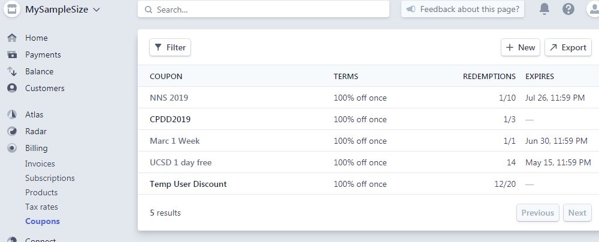
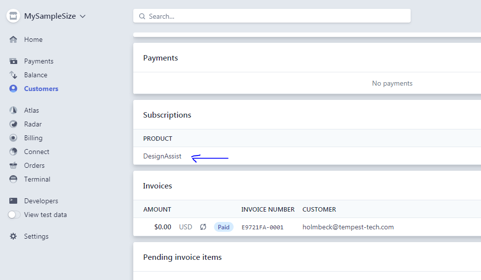
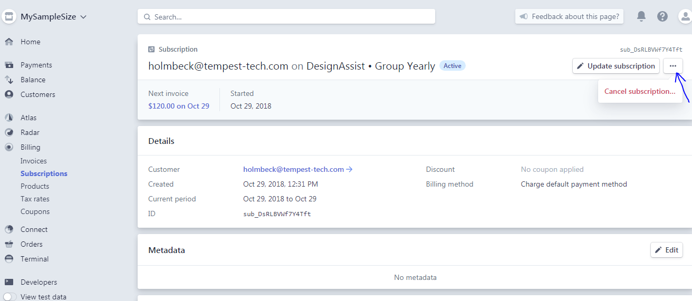
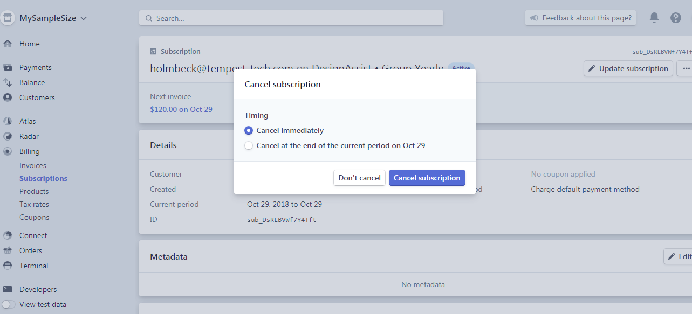

# Coupons

Coupons behave as one would expect: apply a fixed amount or percentage off a [Subscription](./subscriptions) (i.e. payment). 

This simple concept provides some issues for us that we have not addressed yet. For one, we currently only use coupons as "license codes", that is codes to use for group (discounted) subscriptions. If we want to give a *user* a coupon, or ensure a coupon is only applied to a particular [Product](./products), **we need to do some extra work**. 

I'm sure it's possible to filter coupons for products / subscriptions / customers, but again we have not implemented this yet. I would suggest looking into [hooks](https://dashboard.stripe.com/webhooks). 

# How to issue time-limited coupons

Currently, our coupon implementation is related to a license code which gives a user access for a full year. When we do a workshop, for example, we create a coupon for people to use. On that date, users sign up with that coupon, and use the website as a full user. To limit their use to a single day, we have gone into Stripe the next day and cancelled their subscriptions manually.

## Go to user
Go to the user whose subscription you want to cancel. Scroll down to their Subscriptions section.

## Click on subscription
In the upper right, click the three dots to cancel the subscription.

Click on the Product under their subscription to bring you to that particular subscription page.

## Cancel subscription
Confirm the cancellation.

