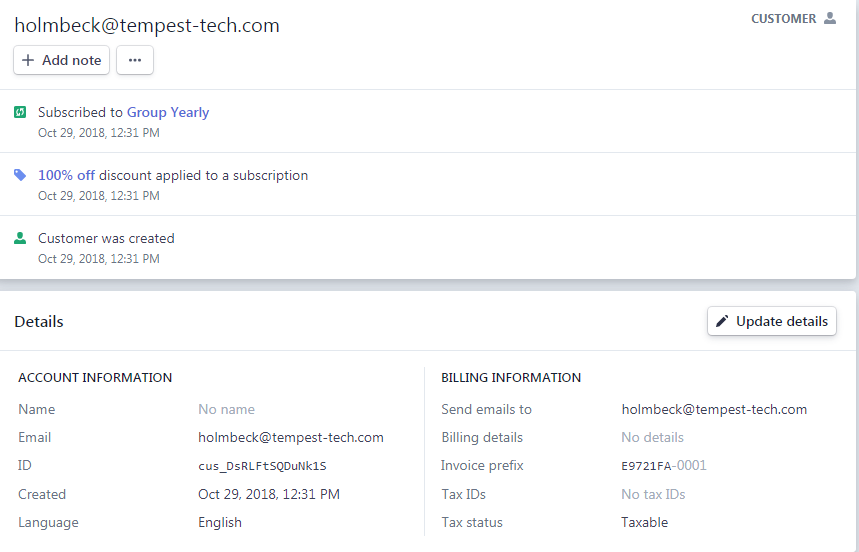

# Customers

Customers represent the basis for Stripe's payments. In order to process a payment, you first create a customer.

Each customer is given a unique `customer_id` which is used for all identification. While the `customer_id` is associated with an email, you can technically have multiple (unique) customers with the same email. In an online business sense, that simply represents a customer buying products more than one time. In our *subscription-based* setup, `customer_id` and email are typically both unique.

Read more about Customer attributes in the API. 

______
Example customer data from the Stripe Dashboard is shown below. 
______

