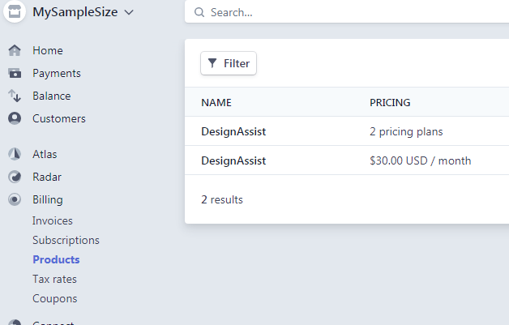

# Products

Stripe Products are the basis on which [Subscriptions](./subscriptions) are applied. They represent the types of items you have for sale. In our case, we have two products:

## A monthly subscription :id=monthly
- Single-user pricing plan
    
## A yearly subscription
- Single-user pricing plan
- Group/bulk users pricing plan

_____

_____

## Note
!> Customers do not interact with products, rather a subscription is generated that applies to that product. 
