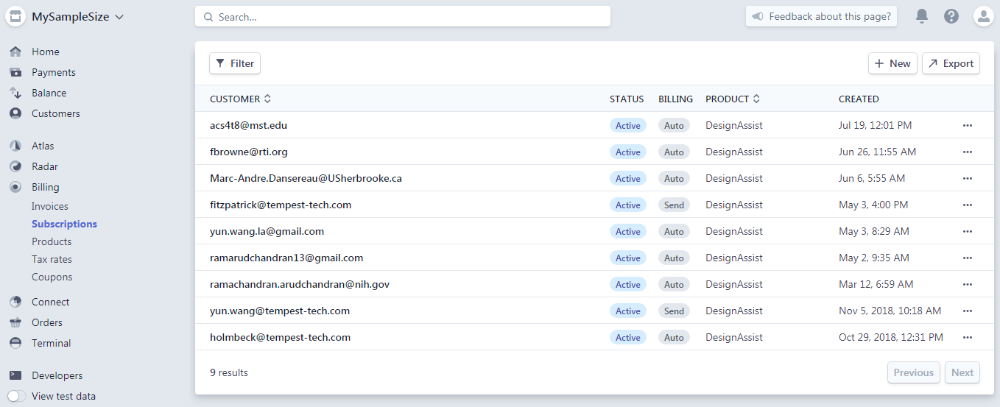

# Subscriptions

Stripe Subscriptions are used to perform recurring payments for a product or service. Subscriptions are essentially [Products](./products) applied to [Customers](./customers). As with customers, each subscription carries its own unique `id`. 

_____
> Example:  
> You might have a single customer request two different services, e.g. (1) a lawn mowing service and (2) a lawn watering service.  In the Stripe sense, this customer would require two different subscriptions.
_____

For our purposes, the unique subscription `id` serves the purpose of determining whether or not a user is up to date on payments, if they are in a trial period, and the next billing cycle (among other things).

More about the Subscriptions object can be found in the API section. 

_____

