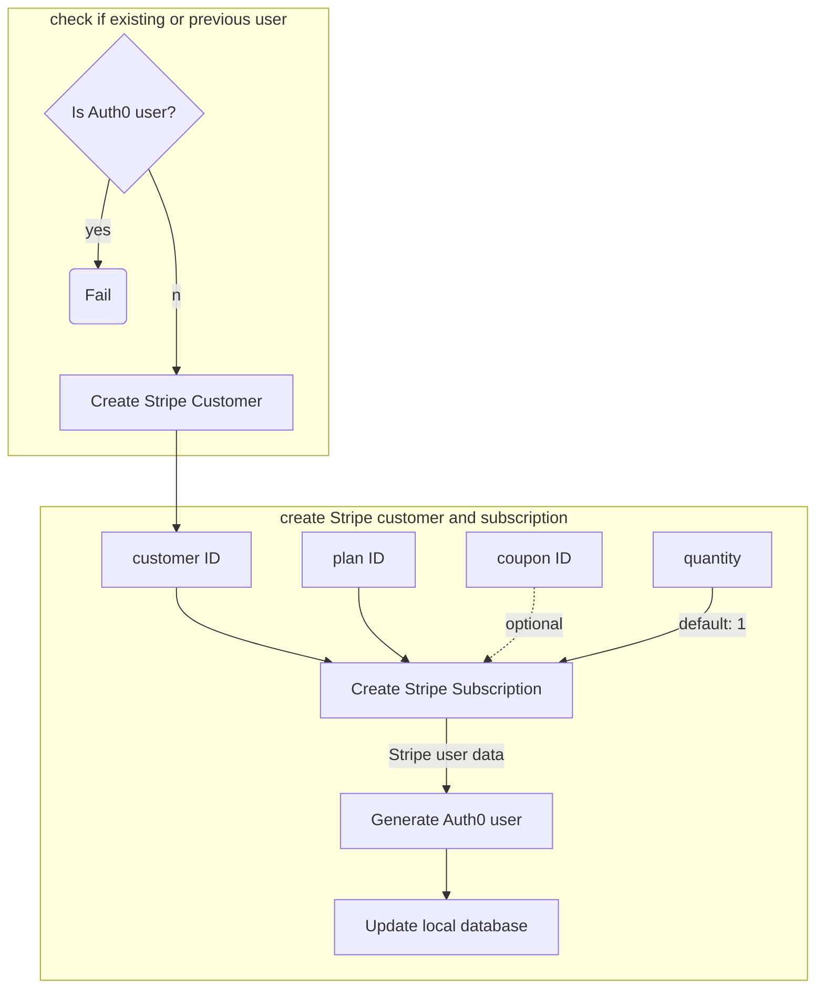

# Stripe Payment Flow

For user payment, we use 

1. the `Card` element to handle tokens for collecting credit card information, and
2. the Stripe-Python API to send the token for payment processing

Under the second issue, we will discuss how a [`Customer`](../concepts/customers) is created and how a payment is applied to that customer. 

_____

After a payment is processed and we check if the user is not already in Auth0, the flow is as follows:
(refresh page if chart is not showing)

Note that the plan ID is hard-coded and can be found in the Stripe dashboard. The customer ID is unique and generated by Stripe. 

With the flowchart in mind, let's look at the other sections to delve deeper into how payments are actually processed.
