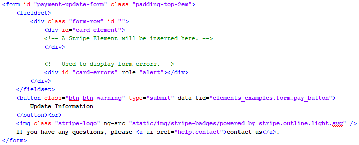
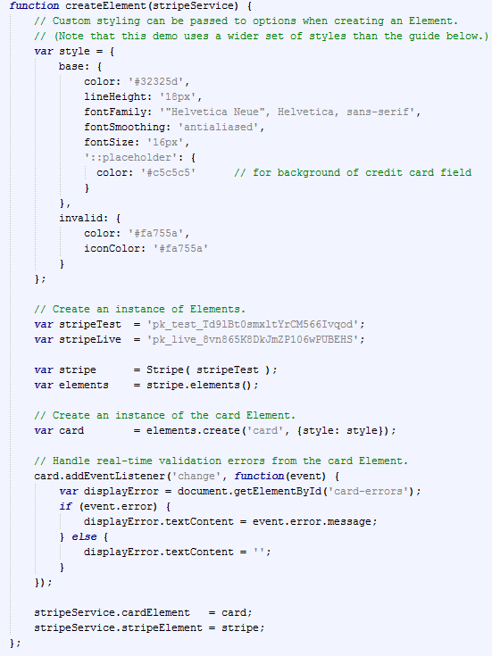
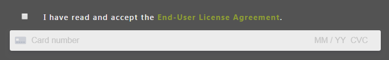

# The `Card` Element

Processing payments with Stripe has two parts:

1. Securely collecting payment details from the customer
2. Using the collected payment method in a [charge request](../api/charge)

For MySampleSize, we use Stripe Elements to dynamically make a payment form that collects card information and turns it into a token. That token contains information only accessible by Stripe, and we (Consilia) do not have access to the card number, expiration date, etc. 


## HTML

In the actual HTML code, the payment form is created very simply, using the `id="card-element"` 



Before we can use this, we must generate the form and mount it to the `<div id="card-element">`.


## Generating the form

Generating the actual Element is contained in stripeService.js.



## Binding the form to an HTML object

Stripe Element creation is used to "mount" the element to a portion of the HTML. In the example below (taken from stripeController.js), we mount the Element to a tag with the id `card-element`. 

```javascript
$scope.make_stripe_element = function() {
  // Add an instance of the card Element into the `card-element` div
  stripeService.cardElement.mount('#card-element');
  
  // Handle form submission.
  var form = document.getElementById('payment-form');
  
  form.addEventListener('submit', function(event) {
    event.preventDefault();
    
    $scope.stripe.info.in_progress = true;
    
    stripeService.stripeElement.createToken(card).then(function(result) {
      if (result.error) {
        // Inform the user if there was an error.
        var errorElement = document.getElementById('card-errors');
        errorElement.textContent = result.error.message;
        
        $scope.stripe.info.in_progress = false;

      } else {
        processStripe(result);
      }
    });
  });
};
```


## End result

In the end, the form entry you see below is generated automatically without **us** having to include or process the card number, expiration date, and CVC number.



________

For reference, the following information is in more detail at https://stripe.com/docs/stripe-js/elements/quickstart.
