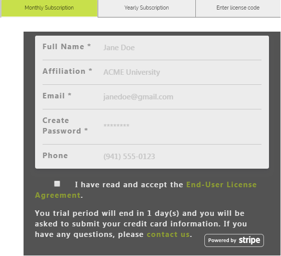
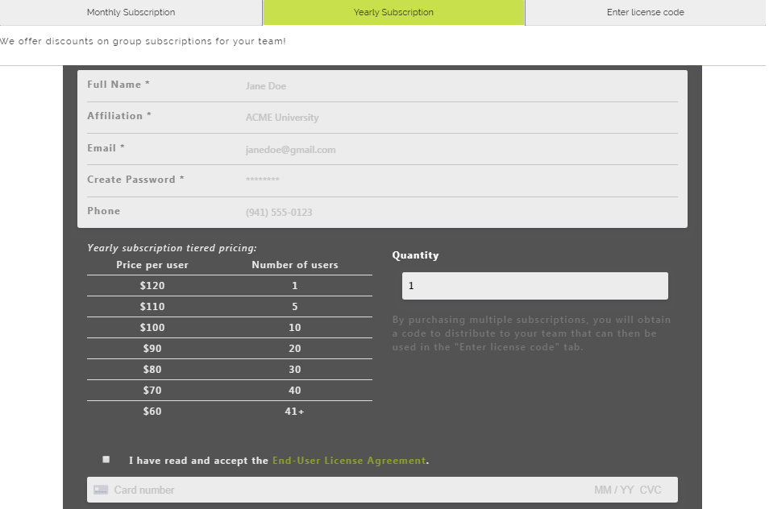
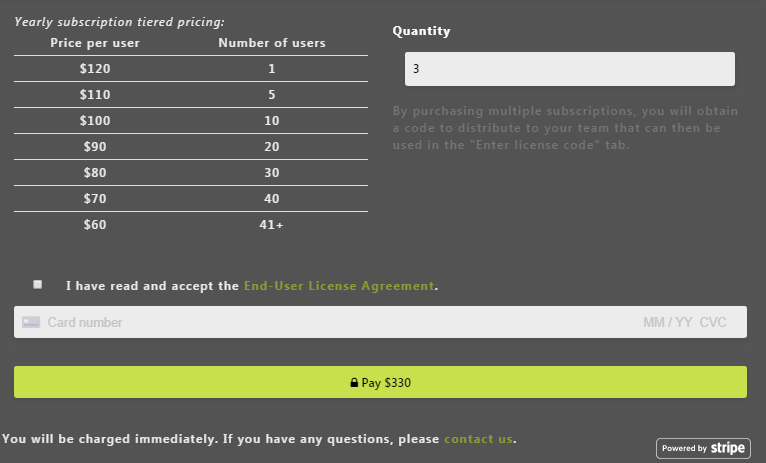
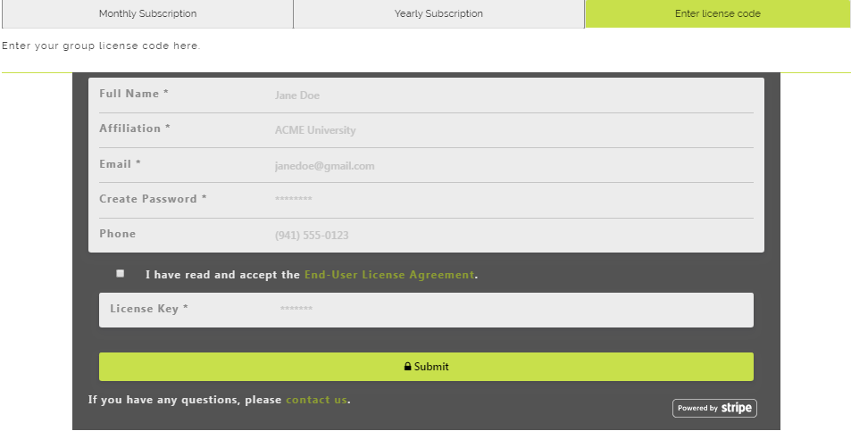

# User Interface

This section simply explains what the user sees and how it's visualized.
______________
# Monthly Subscription

For the first, default tab, the user can input their data to sign up for a monthly-based subscription. To make it easier, we have implemented a simple sign up where no credit card is required, and the user can use the full website for 24 hours. At the end of the 24 hours, they will be asked to provide a credit card to continue on with their monthly subscription. 

______________
# Yearly Subscriptions

The yearly subscription tab is different in both visualization and function, as we do not currently allow a trial period for yearly subscriptions. (The trial period functionality is contained in the Stripe dashboard).

## Single User

The default *quantity* for a yearly subscription is one (1). 

## Multiple Users

If someone selects more than one for the *quantity* field, they will effectively become the "administrator" for a group of accounts. This person becomes the payee and receives a coupon code (a.k.a. _license code_) to distribute to their sub-users. 

______________
# License Code

When someone signs up under a license code, they get a yearly subscription for the coupon amount. Note that we are replacing the Stripe term **Coupon** with **License**. 